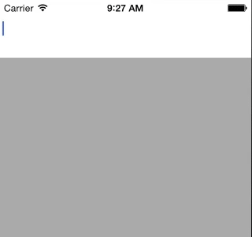

# MJAutoComplete

A simple drop-in for using an autocomplete component on iOS. It comes with a simple demo app that should help you get started in a jiffy!

## Outline

+ **[How To Use](#how-to-use)**: tl;dr ppl go there. Now.
+ **[How It Works](#how-it-works)**: The scary innards and plumbings.
+ **[Gotchas](#gotchas-important)**: **IMPORTANT**, please read before taking Aspirin.
+ **[Demo Walk-through](#demo-walk-through)**: The demo is pretty extensive! Read to make the most out of this component.
+ **[Dependencies](#dependencies)**: Libraries required for this to work.
+ **[Challenges](#challenges)**: Meh, remarks.
+ **[Special Thanks](#special-thanks)**: Hall of Fame.

## How To Use

+ Get the repo in whichever way you like. I endorse submodules, but you are free to use whatever you like.
+ Add the `MJAutoComplete` folder located inside the repo into your project.
+ Write some code!!
	- `#import "MJAutoCompleteManager.h"`
	- Instantiate an instance of the manager, and assign the delegate and the optional dataSource.
	- The delegate must implement one of the `shouldUpdateText` methods from the protocol.
	- Instantiate a few `MJAutoCompleteTriggers` with a delimiter and a list of items (for testing).
	- Add the triggers to the `MJAutoCompleteManager` instance.
	- When you have the container view for the AutoComplete component ready, assign the `MJAutoCompleteManager`'s `container` property to that container.
	- Finally, send the string you want to process using `-[MJAutoCompleteManager processString:]`!

## How It Works

### Terminology

+ **Manager:** The top level object that manages the AutoComplete component.
+ **Trigger:** Defines the delimiter that should display the AutoComplete list, and optionally the list itself and a custom `UITableViewCell` subclass.
+ **Item:** Defines a single AutoComplete option. Other than the arbitrary context `NSDictionary` property, there are two interesting properties:
	- `autoCompleteString`: The string that will be checked against when filtering the list
	- `displayedString`: The string that the user will see in the default `MJAutoCompleteCell` implementation. *(e.g.: autoCompleteString = twitter handle, displayedString = Full name).*

### Set Up

The top level object that you interact with mainly, is the `MJAutoCompleteManager`. The manager retains a `TableViewController` and asks you to assign its `container` to a *UIView* that will host the AutoComplete table view. The manager also provides  a delegate & dataSource interface to interact with the component.

### Processing The Input

##### SENDING THE INPUT TO THE AUTOCOMPLETE MANAGER

After initialization, you would send the whole string the user is typing to the AutoComplete manager through `processString:`. The manager will iterate over the triggers and check whether the input fires any of them.

##### UPON FIRING AN AUTOCOMPLETE TRIGGER

If the input fires a trigger, the manager will check if the dataSource implements the `itemList:` selector. This method is meant for developers who plan to fetch the list asynchronously. This selector is called with a callback that must be called once the list is ready. If the method is not implemented, then the developer must set the item list on the trigger (`trigger.autoCompleteItemList`).

Immidiatly afte the manager gets the result of the trigger, it sends another optional message to the dataSource to filter the list in-place. (i.e. an `NSMutableArray` is passed to the dataSource, and that same object is expected to contain the filtered list on return). If this method is not implemented by the dataSource, the manager will apply a default filter to the list (e.g. `autoCompleteString beginswith[cd] %@`).

Finally, an optional message is sent to the delegate that the AutoComplete table view will appear.

This process actually takes place every time the user types more stuff, even if the AutoComplete table is already displayed. This allows the developer to implement heuristics, such as autoCorrection or something. 

##### DISPLAYING THEM ITEMS

The `MJAutoCompleteTC` (where TC stands for TableViewController) simply dequeues a reusable cell and assigns it with the `MJAutoCompleteItem` for that row to the cell. before returning the cell to the table view, the controller sends a message to the manager, which in turn calls the optional selector on the delegate `autoCompleteManager:willPresentCell:forTrigger:`. This is intended for developers who would like to load data just when the cell is presented (i.e. avatars).

##### SELECTING AN AUTOCOMPLETE OPTION

At this point, the user either enters a character that hides the autoComplete table, such as a whitespace, or they select an AutoComplete option (or they exit the app, or the app crashes, or...). If they select an option, the only required `MJAutoCompleteManagerDelegate` method is called, which is `-[autoCompleteManager:shouldUpdateToText:]`. The implementation of this method is typically to set the string passed by the manager as the new string of the component the user was typing in.

## Gotchas *IMPORTANT!*

+ When sending the list of autoComplete items to the component, make sure it's an array of `MJAutoCompleteItem`s!! Use `[MJAutoCompleteItem autoCompleteCellModelFromStrings:myObjectArray]` if necessary. This will return an `MJAutoCompleteItem` array by passing the `-[NSObject description]` message to all the items in the array.

+ If you would like to use a custom `MJAutoCompleteCell` subclass for the component, make sure that:
	- If you are loading from a nib, set the reuse identifier in the NIB to the subclass name.
	- Assign the subclass string to the corresponding trigger, and it will try to load a nib, and if it can't find one, will simply register the class with the tableView `-[UITableView registerClass:NSClassFromString(...) ...]`.

## Demo Walk-through

####*UNDER CONSTRUCTION*

## Dependencies

+ **NONE**.

## Challenges

### Thumbnail support

#### Problem:

After a default very simple implementation that allowed the developer to lazily load the thumbnails and cache them on their side, I realized that most of the async image loading components for iOS out there are **`UIImageView` categories**. This meant that providing the developer with a model object that has an image property will not be compatible with these components. I thought about embedding a component within the project, like the notorious [SDWebImage](https://github.com/rs/SDWebImage), but that meant that there will be a different internal cache for the component that I must either expose to the developer, or somehow allow the developer to manage/disable.

#### Solution:

The final adapted solution was to remove the thumbnail support *completely*. Instead, a feature was implemented that allowed the developer to subclass the `MJAutoCompleteCell`, hence customize the cell to their heart's content. The reason behind this approach is because I am from a school of thought that supports fine-grain maintainable/replaceable components rather than a huge monolithic component that just tries to do everything.

## Special Thanks

+ The awesome [Haneke](https://github.com/Haneke/Haneke), used for demo purpose only.
+ [alltheragefaces.com](http://alltheragefaces.com/), imagine how much our examples would suck without these services.
